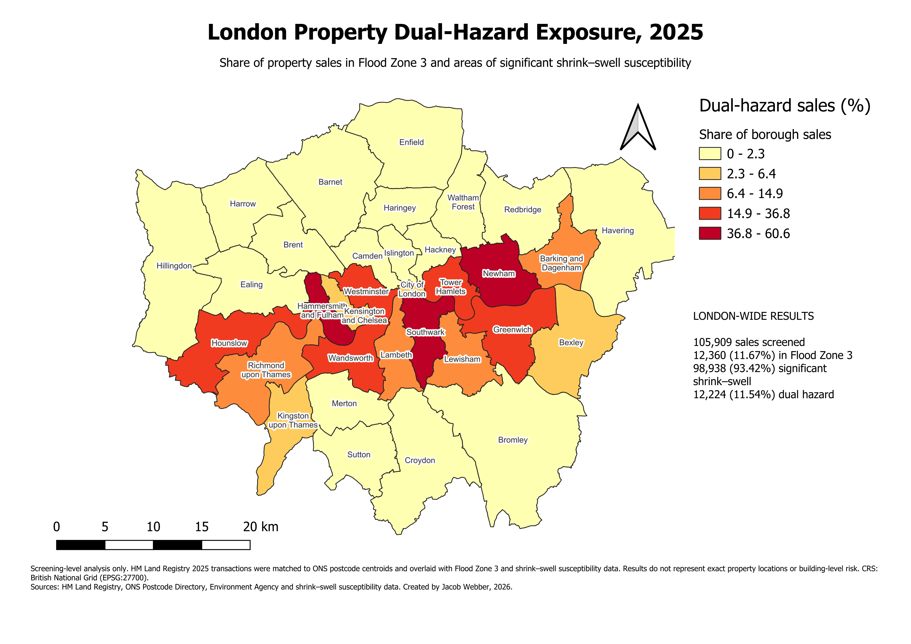
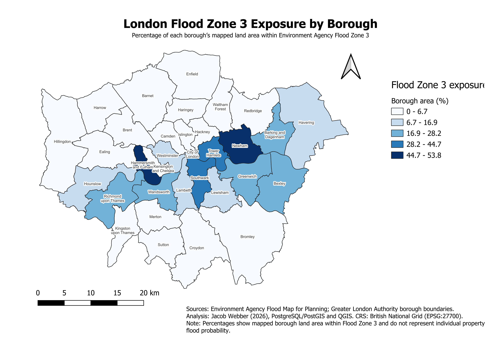

# London Flood and Shrink–Swell Property Exposure

Spatial analysis of 2025 residential property transactions across London, combining flood exposure, shrink–swell susceptibility and borough-level housing-market data.

This project demonstrates an end-to-end geospatial data workflow using PostgreSQL/PostGIS, SQL and QGIS: importing and cleaning large public datasets, performing spatial joins, validating the results and producing portfolio-ready maps and summary outputs.

## Final dual-hazard map



[View the map as a PDF](outputs/london_dual_hazard_exposure_2025.pdf)

## Key findings

| Measure | Result |
| --- | ---: |
| 2025 HM Land Registry transactions processed | 954,145 |
| Transactions matched to London postcodes | 105,909 |
| London boroughs represented | 33 |
| Sales located in Flood Zone 3 | 12,360 (11.67%) |
| Sales in areas of significant shrink–swell susceptibility | 98,938 (93.42%) |
| Sales exposed to both hazards | 12,224 (11.54%) |

The boroughs with the highest shares of dual-hazard sales were:

| Borough | Dual-hazard sales | Share of borough sales | Median sale price |
| --- | ---: | ---: | ---: |
| Hammersmith and Fulham | 1,757 | 60.57% | £670,000 |
| Newham | 1,385 | 50.22% | £445,500 |
| Southwark | 1,858 | 49.81% | £525,000 |

The complete borough results are available in [`outputs/borough_property_hazard_exposure_2025.csv`](outputs/borough_property_hazard_exposure_2025.csv).

## Flood Zone 3 land-area exposure

The supporting map below shows the percentage of each borough's mapped land area within Environment Agency Flood Zone 3.



[View the Flood Zone 3 map as a PDF](outputs/london_flood_zone_3_exposure_by_borough.pdf)

## Project workflow

1. Imported the source datasets into a PostgreSQL/PostGIS database.
2. Standardised postcode fields and validated transaction dates, row counts and missing values.
3. Converted ONS postcode coordinates into British National Grid geometry (EPSG:27700).
4. Matched HM Land Registry transactions to London postcode centroids and boroughs.
5. Used spatial joins to classify each matched transaction by Flood Zone 3 and shrink–swell susceptibility.
6. Aggregated transaction counts, values, median prices and hazard percentages for all 33 London boroughs.
7. Created spatial indexes and analysed the tables for efficient querying.
8. Styled, labelled and exported the final maps in QGIS.

## Database structure

The database is organised into four schemas:

| Schema | Purpose |
| --- | --- |
| `raw` | Source data imported without analytical transformations |
| `staging` | Cleaned fields, standardised postcodes and validated geometry |
| `core` | Reusable London borough, hazard and property-sales spatial tables |
| `analytics` | Property-level hazard classifications and borough summaries |

The main analytical outputs are:

- `core.property_sales_london_2025`
- `analytics.property_hazard_exposure_2025`
- `analytics.borough_property_exposure_2025`

## Tools and techniques

- PostgreSQL 17 and PostGIS
- pgAdmin 4
- QGIS
- SQL data cleaning and transformation
- Spatial joins, coordinate reference systems and GiST indexes
- Data validation and quality assurance
- Choropleth mapping and cartographic layout design
- PowerShell data-preparation scripting

## Data sources

- HM Land Registry Price Paid Data, 2025
- Office for National Statistics Postcode Directory
- Environment Agency Flood Map for Planning
- Greater London Authority borough boundaries
- Shrink–swell susceptibility data

Large source datasets are not stored in this repository. The `data` directory contains the local project structure and supporting instructions where applicable.

## Repository structure

```text
data/       Local source-data structure and documentation
outputs/    Final maps, PDFs and borough summary CSV
qgis/       QGIS project
scripts/    Data-preparation scripts
sql/        Numbered PostgreSQL/PostGIS workflow
```

The property-analysis stages are contained in:

- [`09_create_property_raw_tables.sql`](sql/09_create_property_raw_tables.sql)
- [`10_create_property_staging.sql`](sql/10_create_property_staging.sql)
- [`11_create_london_property_sales.sql`](sql/11_create_london_property_sales.sql)
- [`12_create_property_hazard_exposure.sql`](sql/12_create_property_hazard_exposure.sql)
- [`13_create_borough_property_exposure_summary.sql`](sql/13_create_borough_property_exposure_summary.sql)

Run the numbered SQL files in ascending order to reproduce the full database workflow.

## Important limitation

This is a screening-level analysis. HM Land Registry transactions were matched to ONS postcode centroids rather than exact building coordinates. Hazard classifications therefore describe the mapped postcode-centroid location and should not be interpreted as property-specific flood probability, ground investigation or building-level risk.

## Author

Created by Jacob Webber, 2026.

See [`LICENSE`](LICENSE) for repository licensing information.
